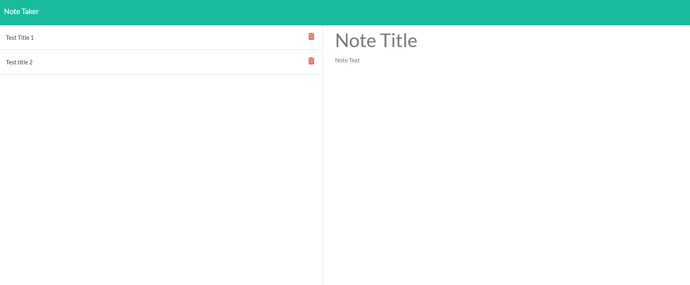

# Module 11 
Node.js

# Objective
This application was created for users to take notes. The notes are fully editable, they are able to be stored and they can also be deleted.

Deployed app: [Note Taker App](https://note-takermodule11-412bf44df662.herokuapp.com/)  <br/> 




# User Story
```
AS A user, I want to be able to write and save notes
I WANT to be able to delete notes I've written before
SO THAT I can organize my thoughts and keep track of tasks I need to complete
```

# Technologies Used
* JavasScript
* Node.js
* Express.js
* mySQL
* npm modules
